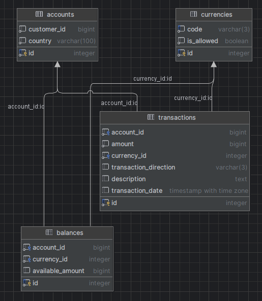

# Assignment

## Requirements
- Implement a core banking solution with functionalities for managing accounts, balances, and transaction histories.
- Integrate with RabbitMQ to publish messages for other consumers.
- Ensure integration tests cover at least 80% of the account service.

## Project Structure
````
account-project/
|-- common/
|-- account/
|-- transaction/
|-- balance/
````

## Database



### Common
Serves as an API gateway for client requests, facilitating communication between microservices. Utilizes RabbitMQ for messaging and exchanges between applications.

### Modules
- **Account:** Handles business logic for accounting, uses BigDecimal for precision, stores allowed currencies in the database.
- **Transaction:** Manages transaction processing.
- **Balance:** Maintains account balances.

## Technologies
- Java 11+
- Spring Boot
- MyBatis
- Gradle
- PostgreSQL
- RabbitMQ
- JUnit

## Running the Application
With docker-compose:
````
account-project/docker-compose.yml
````
- **Docker:** Use the following command to start the services:
  ```bash
  docker-compose -f docker-compose.yml -p account-project up -d
  ```

## Applications Overview
### Account
Manages accounts and their balances. Publishes all insert and update operations to RabbitMQ.

#### APIs
- **Create Account**
    - **Input:** Customer ID, Country, List of currencies
    - **Output:** Account ID, Customer ID, List of balances
    - **Errors:** Invalid currency

Request (Make account - OK):
````bash
curl -X POST http://localhost:8080/api/accounts -H "Content-Type: application/json" -d "{\"customerId\": 2, \"country\": \"US\", \"currencies\": [\"EUR\", \"USD\"]}"
````
Response (Make account - OK):
````json
{"accountId":1,"customerId":2,"balances":[{"id":1,"accountId":1,"currency":"EUR","availableAmount":0},{"id":2,"accountId":1,"currency":"USD","availableAmount":0}]}
````
Request (Make account with invalid currency - ERROR):
````bash
curl -X POST http://localhost:8080/api/accounts -H "Content-Type: application/json" -d "{\"customerId\": 2, \"country\": \"US\", \"currencies\": [\"EUR\", \"XXX\"]}"
````
Response (Make account with invalid currency - ERROR):
````json
{"errorCode":"1001","errorMessage":"Invalid currency."}
````
- **Get Account**
    - **Input:** Account ID
    - **Output:** Account ID, Customer ID, List of balances
    - **Errors:** Account not found

Request (Get account - OK):
````bash
curl -X GET "http://localhost:8080/api/accounts" -H "Content-Type: application/json" -d "{\"accountId\": 1}"
````
Response (Get account - OK):
````json
{"accountId":1,"customerId":2,"balances":[{"id":1,"accountId":1,"currency":"EUR","availableAmount":0},{"id":2,"accountId":1,"currency":"USD","availableAmount":0}]}
````
Request (Get account - NOT FOUND):
````bash
curl -X GET "http://localhost:8080/api/accounts" -H "Content-Type: application/json" -d "{\"accountId\": 999}"
````
Response (Get account - NOT FOUND):
````json
{"errorCode":"1003","errorMessage":"The specified account could not be found."}
````
### Transaction
Handles the creation of transactions and updates account balances accordingly.

#### APIs
- **Create Transaction**
    - **Input:** Account ID, Amount, Currency, Direction, Description
    - **Output:** Transaction details and updated balance
    - **Errors:** Invalid currency, Invalid direction, Invalid amount (if negative amount for example, Insufficient funds, Account missing, Description missing

Request (Make Deposit - OK):
````bash
curl -X POST "http://localhost:8080/api/transactions" -H "Content-Type: application/json" -d "{\"accountId\":1,\"amount\":500.00,\"currency\":\"USD\",\"transactionDirection\":\"IN\",\"description\":\"Initial deposit\"}"
````
Response (Make Deposit - OK):
````json
{"accountId":1,"transactionId":1,"amount":500.00,"currency":"USD","transactionDirection":"IN","description":"Initial deposit","balanceAfterTransaction":500.00}
````
Request (Make Withdraw - OK):
````bash
curl -X POST "http://localhost:8080/api/transactions" -H "Content-Type: application/json" -d "{\"accountId\":1,\"amount\":100.00,\"currency\":\"USD\",\"transactionDirection\":\"OUT\",\"description\":\"My withdrawal\"}"
````
Response (Make Withdraw - OK):
````json
{"accountId":1,"transactionId":2,"amount":100.00,"currency":"USD","transactionDirection":"OUT","description":"My withdrawal","balanceAfterTransaction":400.00}
````

Request (Make Transaction - ERROR INVALID CURRENCY):
````bash
curl -X POST "http://localhost:8080/api/transactions" -H "Content-Type: application/json" -d "{\"accountId\":1,\"amount\":100.00,\"currency\":\"XXX\",\"transactionDirection\":\"OUT\",\"description\":\"My withdrawal\"}"
````
Response (Make Transaction - ERROR INVALID CURRENCY):
````json
{"errorCode":"1001","errorMessage":"Invalid currency."}
````
Request (Make Transaction - ERROR INVALID DIRECTION):
````bash
curl -X POST "http://localhost:8080/api/transactions" -H "Content-Type: application/json" -d "{\"accountId\":1,\"amount\":100.00,\"currency\":\"USD\",\"transactionDirection\":\"XXX\",\"description\":\"My withdrawal\"}"
````
Response (Make Transaction - ERROR INVALID DIRECTION):
````json
{"errorCode":"1007","errorMessage":"Transaction direction is invalid and must be 'IN' or 'OUT'."}
````
Request (Make Transaction - ERROR):
````bash
curl -X POST "http://localhost:8080/api/transactions" -H "Content-Type: application/json" -d "{\"accountId\":1,\"amount\":-100.00,\"currency\":\"USD\",\"transactionDirection\":\"OUT\",\"description\":\"My withdrawal\"}"
````
Response (Make Transaction - ERROR):
````json
{"errorCode":"1006","errorMessage":"The amount must be positive."}
````
Request (Make Transaction - ERROR INSUFFICIENT FUNDS):
````bash
curl -X POST "http://localhost:8080/api/transactions" -H "Content-Type: application/json" -d "{\"accountId\":1,\"amount\":10000000.00,\"currency\":\"USD\",\"transactionDirection\":\"OUT\",\"description\":\"My withdrawal\"}"
````
Response (Make Transaction - ERROR INSUFFICIENT FUNDS):
````json
{"errorCode":"1002","errorMessage":"Insufficient funds for this transaction."}
````
Request (Make Transaction - ERROR ACCOUNT MISSING):
````bash
curl -X POST "http://localhost:8080/api/transactions" -H "Content-Type: application/json" -d "{\"accountId\":999,\"amount\":100.00,\"currency\":\"USD\",\"transactionDirection\":\"OUT\",\"description\":\"My withdrawal\"}"
````
Response (Make Transaction - ERROR ACCOUNT MISSING):
````json
{"errorCode":"1012","errorMessage":"Balance not found for the specified account and currency."}
````
Request (Make Transaction - ERROR DESCRIPTION MISSING):
````bash
curl -X POST "http://localhost:8080/api/transactions" -H "Content-Type: application/json" -d "{\"accountId\":1,\"amount\":100.00,\"currency\":\"USD\",\"transactionDirection\":\"OUT\",\"description\":\"\"}"
````
Response (Make Transaction - ERROR DESCRIPTION MISSING):
````json
{"errorCode":"1013","errorMessage":"Description is required."}
````

Request (Get account Transactions - OK):
````bash
curl -X GET "http://localhost:8080/api/transactions/1" -H "Content-Type: application/json"
````
Response (Get account Transactions - OK):
````json
{"accountId":1,"transactions":[{"id":1,"accountId":1,"amount":500,"currency":"USD","transactionDirection":"IN","description":"Initial deposit","transactionDate":"2024-04-17T02:29:13.579482Z"},{"id":2,"accountId":1,"amount":100,"currency":"USD","transactionDirection":"OUT","description":"My withdrawal","transactionDate":"2024-04-17T02:29:43.905174Z"}]}
````
Request (Get account Transactions - ERROR INVALID ACCOUNT):
````bash
curl -X GET "http://localhost:8080/api/transactions/999" -H "Content-Type: application/json"
````
Response (Get account Transactions - ERROR INVALID ACCOUNT):
````json
{"errorCode":"1003","errorMessage":"Invalid account. The specified account could not be found."}
````

### Integration Test
Uses JaCoCo to ensure over 80% test coverage.
As only the account service coverage was required, the integration test is only for the account service.
To run tests:
```bash
cd account-project/
./gradlew integrationTest
```
Coverage report available at:
```bash
cd account-project\account\build\reports\jacoco\integrationTest\html
```

## Scaling Considerations
To support horizontal scaling, we could consider implementing load balancers and container orchestration with Kubernetes and Rancher.
Current microservices are stateless, so scaling should be straightforward. Rabbit MQ should prevent concurrency issues.
Though there might be issues scaling rabbitMQ itself, but should work with multiple nodes in cluster environment using mirrored queues for high availability. 

## Performance
Stress tests implemented using JMeter indicate transaction handling capabilities; details available in report.
Though testing results don't reflect actual capabilities, it is limited to due to running on a local machine.

## Error Handling
Could be improved by implementing DLX, asynchronous error handling with RabbitMQ or by other means,
but for now ResponseWrapperDTO is used to handle synchronous errors.

## MonoRepo
MonoRepo structure is used for this project, which is beneficial for managing multiple microservices in a single repository.
Gradle is used for dependency management, and Docker for containerization.
Though in production, it is recommended to use separate repositories for each microservice.
